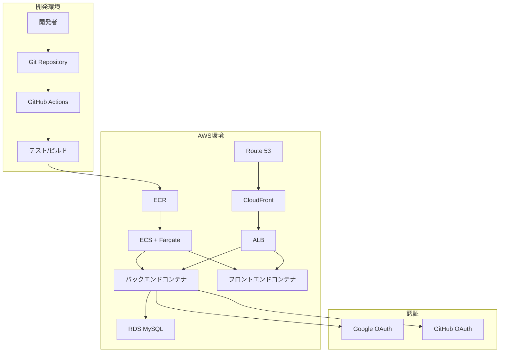
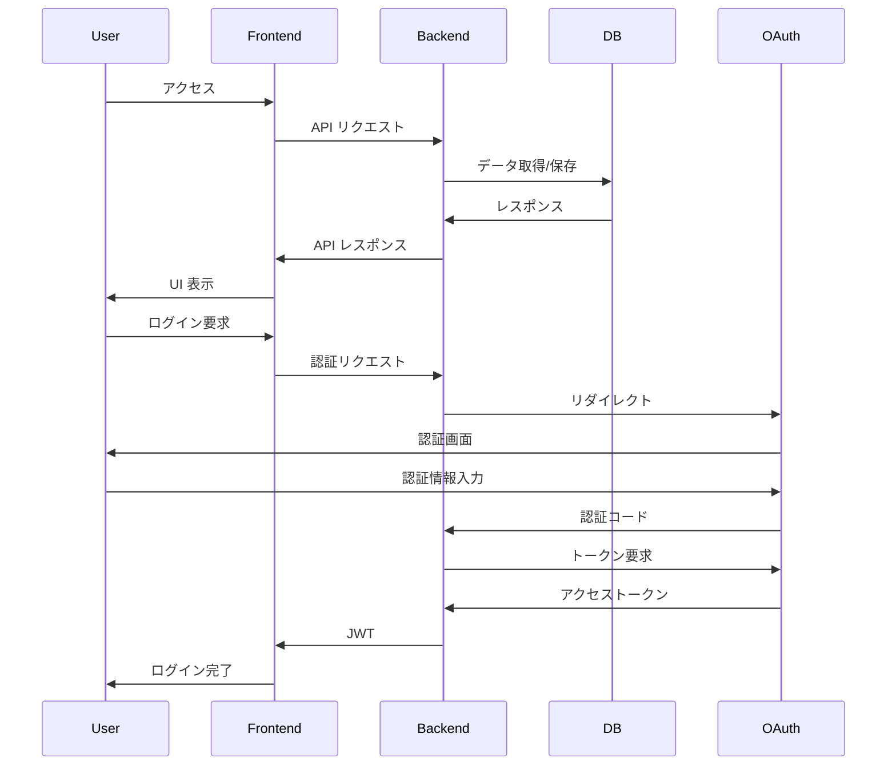

# Todo アプリ Docker 開発環境 計画書

## プロジェクト概要

実務に近い形で、フロントエンドとバックエンドを分離した構成の Todo アプリを開発するための環境を構築します。

### 技術スタック

**バックエンド**:

- Laravel (最新安定版)
- MySQL
- Pest (テストコード)
- SNS ログイン (Google、GitHub)
- Docker

**フロントエンド**:

- React (最新安定版)
- Vite
- TailwindCSS
- Jest/React Testing Library (テストコード)
- Docker

**CI/CD**:

- GitHub Actions

**デプロイ先**:

- AWS (ECS + Fargate)

## プロジェクト構造

以下のようなプロジェクト構造を提案します：

```
todo-app/
├── docker/
│   ├── mysql/
│   │   └── init.sql
│   ├── nginx/
│   │   └── default.conf
│   ├── php/
│   │   └── Dockerfile
│   └── node/
│       └── Dockerfile
├── backend/
│   ├── app/
│   ├── tests/
│   ├── routes/
│   ├── .env.example
│   └── ...
├── frontend/
│   ├── src/
│   ├── public/
│   ├── tests/
│   ├── .env.example
│   └── ...
├── .github/
│   └── workflows/
│       ├── backend-ci.yml
│       ├── frontend-ci.yml
│       ├── backend-cd.yml
│       └── frontend-cd.yml
├── docker-compose.yml
├── docker-compose.prod.yml
└── README.md
```

## Docker 環境設計

実務に近い形で、開発環境では単一の`docker-compose.yml`でフロントエンドとバックエンドを管理し、本番環境では分離できるように設計します。

### docker-compose.yml (開発環境)

```yaml
version: "3.8"

services:
  # バックエンドサービス
  backend:
    build:
      context: ./docker/php
    volumes:
      - ./backend:/var/www/html
    depends_on:
      - db
    networks:
      - app-network

  # フロントエンドサービス
  frontend:
    build:
      context: ./docker/node
    volumes:
      - ./frontend:/app
    ports:
      - "3000:3000"
    command: npm run dev
    networks:
      - app-network

  # Webサーバー (バックエンドAPI用)
  nginx:
    image: nginx:alpine
    ports:
      - "8000:80"
    volumes:
      - ./backend:/var/www/html
      - ./docker/nginx/default.conf:/etc/nginx/conf.d/default.conf
    depends_on:
      - backend
    networks:
      - app-network

  # データベース
  db:
    image: mysql:8.0
    ports:
      - "3306:3306"
    environment:
      MYSQL_DATABASE: todo_app
      MYSQL_ROOT_PASSWORD: root
      MYSQL_USER: todo_user
      MYSQL_PASSWORD: todo_password
    volumes:
      - db-data:/var/lib/mysql
      - ./docker/mysql/init.sql:/docker-entrypoint-initdb.d/init.sql
    networks:
      - app-network

  # PHPMyAdmin (開発用)
  phpmyadmin:
    image: phpmyadmin/phpmyadmin
    ports:
      - "8080:80"
    environment:
      PMA_HOST: db
      MYSQL_ROOT_PASSWORD: root
    depends_on:
      - db
    networks:
      - app-network

networks:
  app-network:
    driver: bridge

volumes:
  db-data:
```

## バックエンド (Laravel) 実装計画

1. **API モード設定**

   - Laravel API リソース
   - API 認証（Sanctum）
   - API ルーティング

2. **テストコード**

   - Pest によるテスト
   - 機能テスト
   - API テスト

3. **SNS ログイン**

   - Laravel Socialite を使用
   - Google、GitHub プロバイダー設定

4. **エラーハンドリング**

   - グローバルエラーハンドラー
   - API レスポンス標準化
   - ログ管理

5. **CI/CD (GitHub Actions)**
   - テスト自動化
   - コード品質チェック
   - 自動デプロイ

## フロントエンド (React) 実装計画

1. **プロジェクト設定**

   - Vite + React
   - TailwindCSS 設定
   - コンポーネント構造

2. **テストコード**

   - Jest
   - React Testing Library
   - E2E テスト (Cypress)

3. **UI バリデーション**

   - フォームバリデーション
   - エラーメッセージ表示
   - ユーザーフィードバック

4. **CI/CD (GitHub Actions)**
   - テスト自動化
   - ビルド
   - 自動デプロイ

## AWS デプロイ計画 (ECS + Fargate)

ECS + Fargate を使用したデプロイ計画を詳細に説明します：

### 1. インフラストラクチャ設計

- **VPC 設定**:

  - 複数のアベイラビリティゾーン
  - パブリックサブネットとプライベートサブネット
  - セキュリティグループ

- **ECS クラスター**:

  - Fargate タイプのクラスター
  - タスク定義（フロントエンド、バックエンド）
  - サービス設定

- **ロードバランサー**:

  - Application Load Balancer (ALB)
  - ターゲットグループ
  - ヘルスチェック設定

- **データベース**:
  - RDS MySQL
  - マルチ AZ 設定
  - バックアップ設定

### 2. CI/CD パイプライン

- **ECR リポジトリ**:

  - フロントエンド用リポジトリ
  - バックエンド用リポジトリ

- **GitHub Actions**:
  - テスト実行
  - Docker イメージビルド
  - ECR へのプッシュ
  - ECS サービス更新

### 3. セキュリティ設定

- **IAM ロール**:

  - ECS タスク実行ロール
  - CodeBuild サービスロール

- **シークレット管理**:

  - AWS Secrets Manager
  - 環境変数の安全な管理

- **ネットワークセキュリティ**:
  - WAF 設定
  - セキュリティグループルール

### 4. モニタリングと運用

- **CloudWatch**:

  - ログ収集
  - アラーム設定
  - ダッシュボード

- **X-Ray**:
  - トレース分析
  - パフォーマンスモニタリング

## バックエンド学習ロードマップ

バックエンドの知識を深めるための学習ロードマップを各トピックごとに整理します。

### 1. Laravel API モード

**初級レベル**:

1. Laravel 基本概念の理解（ルーティング、コントローラー、モデル）
2. API リソースの基本
3. 基本的な CRUD 操作の実装

**中級レベル**:

1. API 認証（Sanctum）の実装
2. API リソースの高度な使用法
3. API のバージョニング
4. レート制限の実装

**上級レベル**:

1. API ドキュメント自動生成（Swagger/OpenAPI）
2. API キャッシュ戦略
3. マイクロサービスアーキテクチャの理解と実装

**学習リソース**:

- [Laravel 公式ドキュメント - API リソース](https://laravel.com/docs/10.x/eloquent-resources)
- [Laravel Sanctum ドキュメント](https://laravel.com/docs/10.x/sanctum)
- [Laracasts - Laravel API チュートリアル](https://laracasts.com/)

### 2. テストコード (Pest)

**初級レベル**:

1. Pest の基本概念と設定
2. 基本的な単体テストの作成
3. テストデータベースの設定

**中級レベル**:

1. モックとスタブの使用
2. HTTP テスト（API エンドポイントのテスト）
3. テストカバレッジの測定

**上級レベル**:

1. TDD アプローチの採用
2. CI/CD パイプラインへのテスト統合
3. パフォーマンステスト

**学習リソース**:

- [Pest 公式ドキュメント](https://pestphp.com/docs/introduction)
- [Laravel + Pest チュートリアル](https://pestphp.com/docs/laravel)
- [テスト駆動 Laravel](https://course.testdrivenlaravel.com/)

### 3. Docker Compose

**初級レベル**:

1. Docker の基本概念（コンテナ、イメージ）
2. 基本的な docker-compose.yml の作成
3. コンテナの起動、停止、再構築

**中級レベル**:

1. 複数サービスの連携
2. ボリュームとネットワークの管理
3. 環境変数の活用

**上級レベル**:

1. 本番環境用の最適化
2. マルチステージビルド
3. Docker Swarm または k8s への移行準備

**学習リソース**:

- [Docker 公式ドキュメント](https://docs.docker.com/)
- [Laradock](https://laradock.io/)
- [Docker for PHP Developers](https://phpdocker.io/documentation)

### 4. SNS ログイン

**初級レベル**:

1. OAuth2.0 の基本概念
2. Laravel Socialite のインストールと設定
3. 基本的なプロバイダー（Google、GitHub）の設定

**中級レベル**:

1. ユーザーデータの保存と更新
2. 複数の SNS アカウントの連携
3. トークン管理とリフレッシュ

**上級レベル**:

1. カスタムプロバイダーの作成
2. セキュリティ強化（PKCE、state 検証）
3. ソーシャルログインの分析と最適化

**学習リソース**:

- [Laravel Socialite ドキュメント](https://laravel.com/docs/10.x/socialite)
- [OAuth 2.0 の仕様](https://oauth.net/2/)
- [Google OAuth 開発者ガイド](https://developers.google.com/identity/protocols/oauth2)

### 5. エラーハンドリング

**初級レベル**:

1. Laravel の例外処理の基本
2. 基本的なエラーレスポンスの作成
3. ログの基本設定

**中級レベル**:

1. カスタム例外クラスの作成
2. API レスポンスの標準化
3. 詳細なログ記録と監視

**上級レベル**:

1. グローバルエラーハンドラーの最適化
2. 外部サービス（Sentry、Bugsnag）との連携
3. エラー分析とパフォーマンス最適化

**学習リソース**:

- [Laravel 例外処理ドキュメント](https://laravel.com/docs/10.x/errors)
- [API エラーレスポンスのベストプラクティス](https://www.rfc-editor.org/rfc/rfc7807)
- [Laravel ログ設定](https://laravel.com/docs/10.x/logging)

### 6. CI/CD

**初級レベル**:

1. GitHub Actions の基本概念
2. 基本的なワークフローファイルの作成
3. テスト自動化の設定

**中級レベル**:

1. 複数環境（開発、ステージング、本番）のデプロイ
2. シークレット管理
3. キャッシュと最適化

**上級レベル**:

1. マトリックスビルド
2. 自動セマンティックバージョニング
3. 高度なデプロイ戦略（Blue/Green、Canary）

**学習リソース**:

- [GitHub Actions 公式ドキュメント](https://docs.github.com/ja/actions)
- [Laravel GitHub Actions の例](https://github.com/actions/starter-workflows/tree/main/ci)
- [CI/CD のベストプラクティス](https://www.atlassian.com/continuous-delivery/principles/continuous-integration-vs-delivery-vs-deployment)

### 7. AWS デプロイ

**初級レベル**:

1. AWS の基本概念（IAM、VPC、EC2）
2. ECS の基本設定
3. RDS の基本設定

**中級レベル**:

1. ECS + Fargate の設定
2. ロードバランサーと Auto Scaling
3. CloudFormation または Terraform によるインフラのコード化

**上級レベル**:

1. マルチ AZ 構成
2. セキュリティ最適化
3. コスト最適化とモニタリング

**学習リソース**:

- [AWS ECS ドキュメント](https://docs.aws.amazon.com/ja_jp/AmazonECS/latest/developerguide/Welcome.html)
- [AWS Fargate ドキュメント](https://docs.aws.amazon.com/ja_jp/AmazonECS/latest/developerguide/AWS_Fargate.html)
- [AWS for PHP Developers](https://aws.amazon.com/jp/php/)

## Mermaid 図による全体アーキテクチャ




